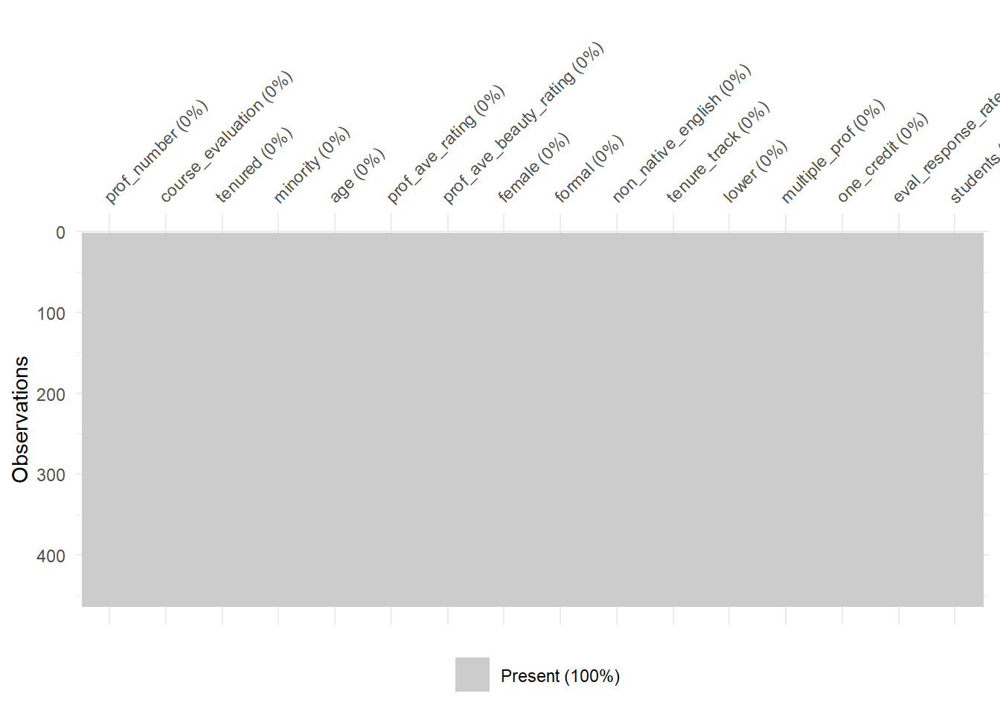
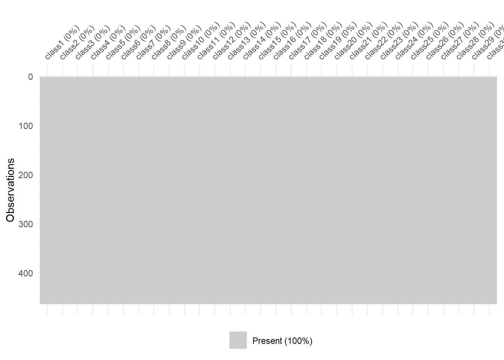
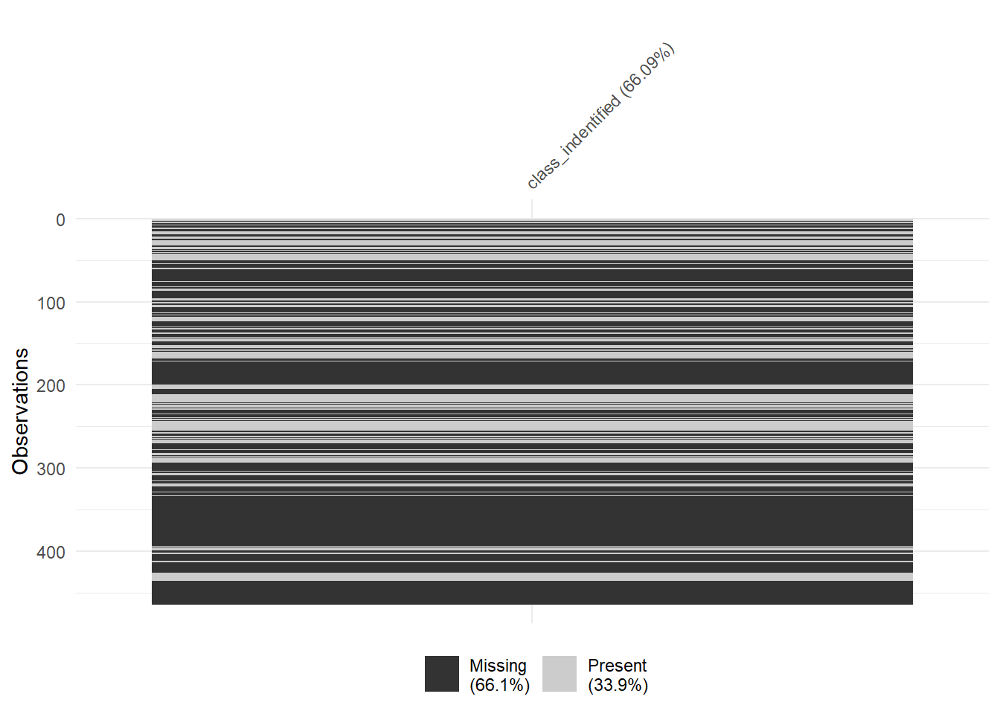
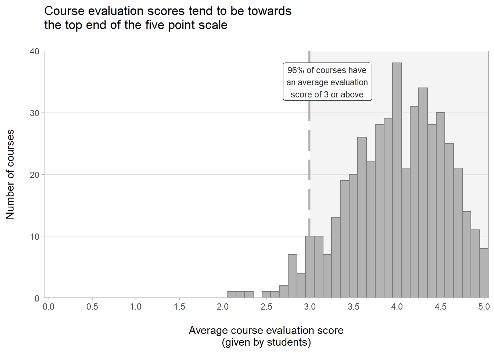
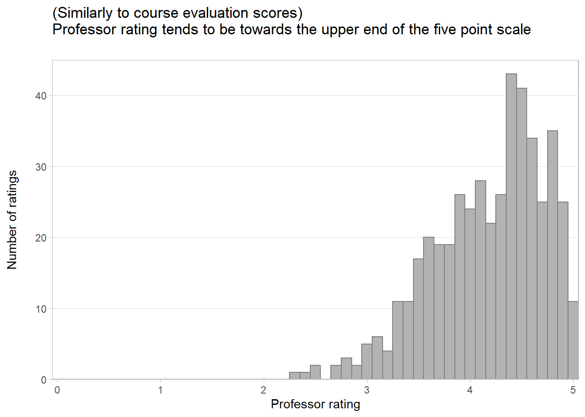
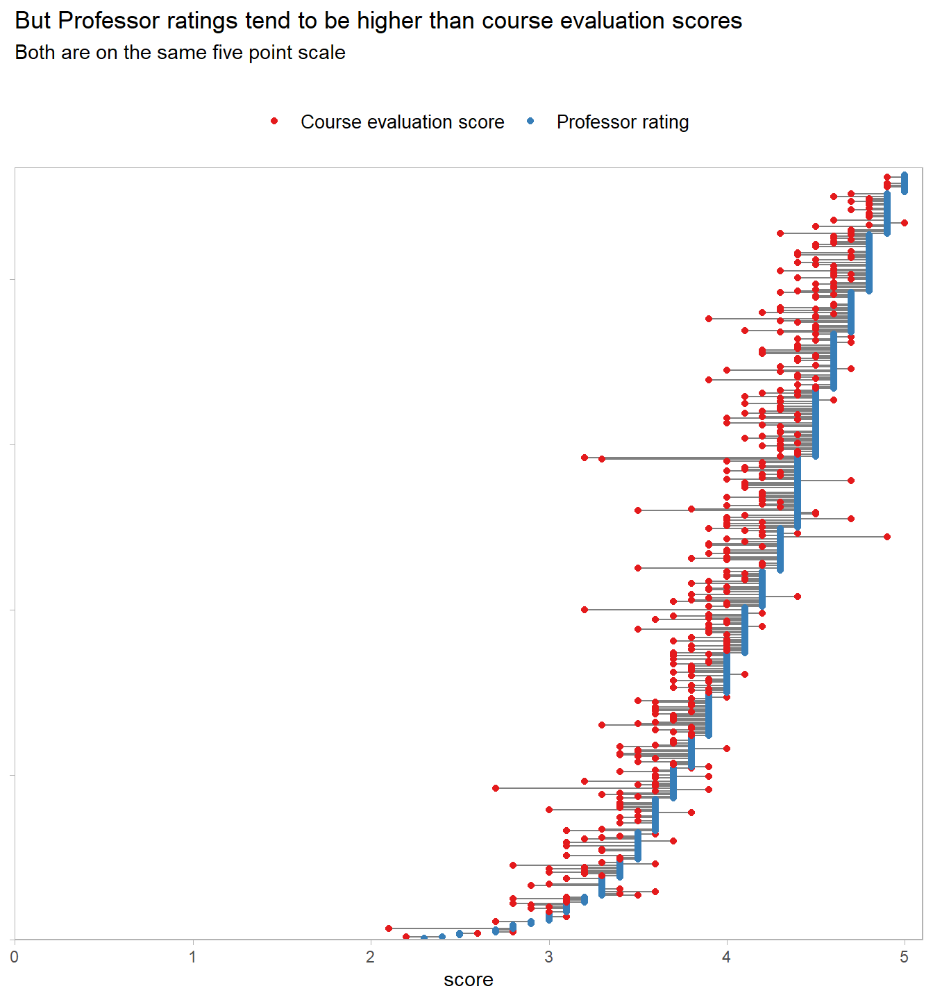
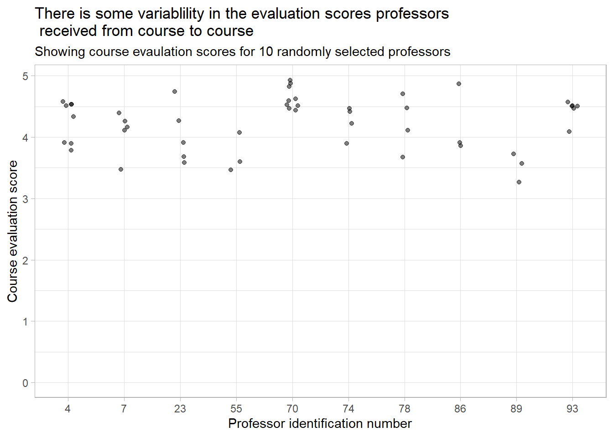
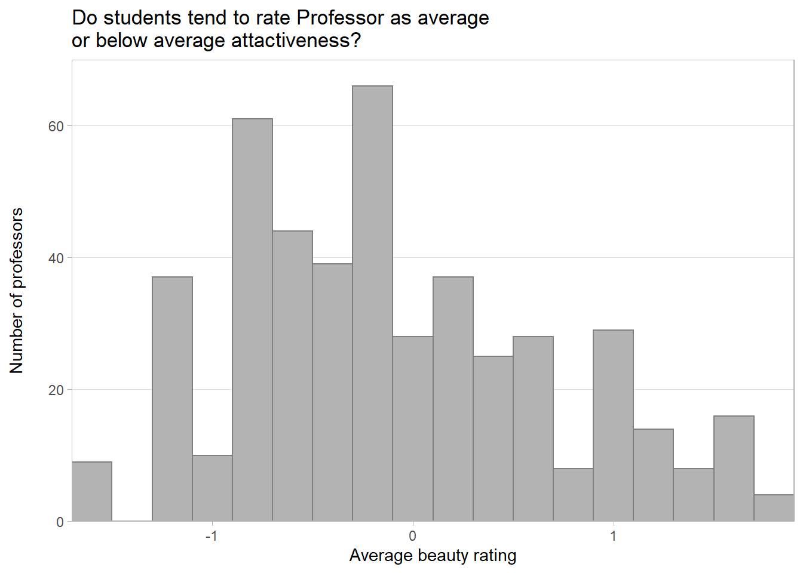
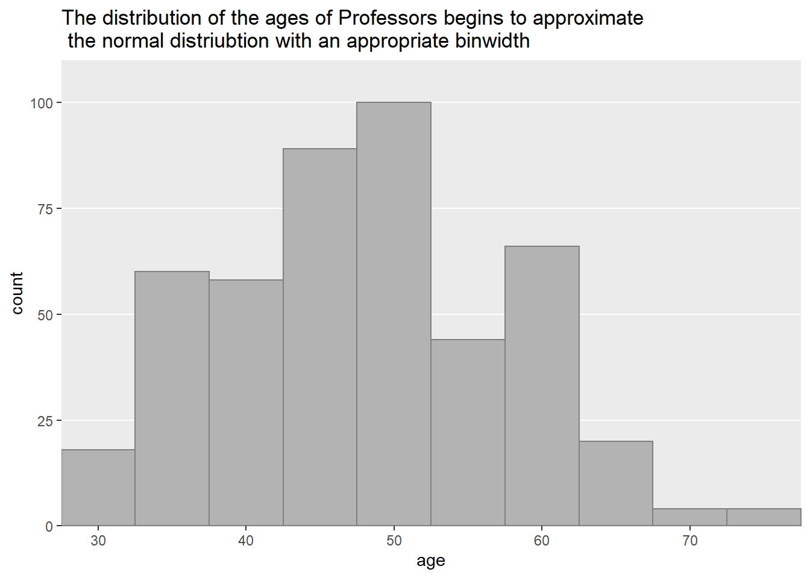

# Linear regression: Predicting course evaluation scores


```r
# import packages used in this notebook
suppressPackageStartupMessages({
  suppressWarnings({
    
    # core libraries
    library(tidyverse)
          
    # helper libraries
    library(janitor)  # for cleaning names
    library(skimr)    # for summary statistic reports
    library(glue)     # for string formattin
  })
})
```


```r
# global setting for notebook
theme_set(theme_light())

# import my own plotting functions for styling plots
source("plotting_functions.R")
```

## Data importing and cleaning

### Importing the data

The data I am using in this project is available in the github repository for the book 'Regression and Other Stories'. So, I can read in the csv directly from the repository.


```r
# set url for dataset
data_url <- "https://raw.githubusercontent.com/avehtari/ROS-Examples/master/Beauty/data/ProfEvaltnsBeautyPublic.csv"

# read data from github
teaching_eval <- read_csv(data_url) %>% 
  janitor::clean_names() # try to clean up names

# display dataframe for initial inspection
glimpse(teaching_eval)
```

```
## Rows: 463
## Columns: 64
## $ tenured           <dbl> 0, 1, 1, 1, 0, 1, 0, 1, 0, 0, 0, 0, 1, 1, 0, 1, 0, 0~
## $ profnumber        <dbl> 1, 2, 3, 4, 5, 6, 7, 8, 9, 10, 11, 12, 13, 14, 15, 1~
## $ minority          <dbl> 1, 0, 0, 0, 0, 0, 0, 0, 0, 0, 1, 0, 0, 0, 0, 0, 0, 0~
## $ age               <dbl> 36, 59, 51, 40, 31, 62, 33, 51, 33, 47, 35, 37, 42, ~
## $ beautyf2upper     <dbl> 6, 2, 5, 4, 9, 5, 5, 6, 5, 6, 4, 5, 5, 5, 7, 3, 1, 6~
## $ beautyflowerdiv   <dbl> 5, 4, 5, 2, 7, 6, 4, 4, 3, 5, 5, 4, 4, 3, 6, 2, 3, 3~
## $ beautyfupperdiv   <dbl> 7, 4, 2, 5, 9, 6, 4, 6, 7, 7, 7, 5, 7, 3, 7, 4, 4, 5~
## $ beautym2upper     <dbl> 6, 3, 3, 2, 6, 6, 4, 3, 5, 6, 7, 4, 5, 5, 4, 7, 3, 4~
## $ beautymlowerdiv   <dbl> 2, 2, 2, 3, 7, 5, 4, 2, 5, 3, 2, 3, 4, 1, 5, 5, 2, 4~
## $ beautymupperdiv   <dbl> 4, 3, 3, 3, 6, 5, 4, 3, 3, 6, 4, 5, 4, 7, 4, 4, 2, 4~
## $ btystdave         <dbl> 0.2015666, -0.8260813, -0.6603327, -0.7663125, 1.421~
## $ btystdf2u         <dbl> 0.2893519, -1.6193560, -0.1878249, -0.6650018, 1.720~
## $ btystdfl          <dbl> 0.4580018, -0.0735065, 0.4580018, -1.1365230, 1.5210~
## $ btystdfu          <dbl> 0.8758139, -0.5770065, -1.5455530, -0.0927330, 1.844~
## $ btystdm2u         <dbl> 0.6817153, -1.1319040, -1.1319040, -1.7364440, 0.681~
## $ btystdml          <dbl> -0.9000649, -0.9000649, -0.9000649, -0.3125226, 2.03~
## $ btystdmu          <dbl> -0.1954181, -0.6546507, -0.6546507, -0.6546507, 0.72~
## $ class1            <dbl> 0, 0, 0, 0, 0, 0, 0, 0, 0, 0, 0, 0, 0, 0, 0, 0, 0, 0~
## $ class2            <dbl> 0, 0, 0, 1, 0, 0, 0, 0, 0, 0, 0, 0, 0, 0, 0, 0, 0, 0~
## $ class3            <dbl> 1, 0, 0, 0, 0, 0, 0, 0, 0, 0, 0, 0, 0, 0, 0, 0, 0, 0~
## $ class4            <dbl> 0, 0, 1, 0, 0, 0, 1, 0, 0, 1, 1, 0, 0, 0, 0, 0, 0, 0~
## $ class5            <dbl> 0, 0, 0, 0, 0, 0, 0, 0, 0, 0, 0, 0, 0, 0, 0, 0, 0, 0~
## $ class6            <dbl> 0, 0, 0, 0, 0, 0, 0, 0, 0, 0, 0, 0, 0, 0, 0, 0, 0, 0~
## $ class7            <dbl> 0, 0, 0, 0, 0, 0, 0, 0, 0, 0, 0, 0, 0, 0, 0, 0, 0, 0~
## $ class8            <dbl> 0, 0, 0, 0, 0, 0, 0, 0, 0, 0, 0, 0, 0, 0, 0, 0, 0, 0~
## $ class9            <dbl> 0, 0, 0, 0, 0, 0, 0, 0, 0, 0, 0, 0, 0, 0, 1, 1, 0, 0~
## $ class10           <dbl> 0, 0, 0, 0, 0, 0, 0, 0, 0, 0, 0, 0, 0, 0, 0, 0, 1, 0~
## $ class11           <dbl> 0, 0, 0, 0, 0, 0, 0, 0, 0, 0, 0, 0, 0, 0, 0, 0, 0, 0~
## $ class12           <dbl> 0, 0, 0, 0, 0, 0, 0, 0, 0, 0, 0, 0, 0, 0, 0, 0, 0, 0~
## $ class13           <dbl> 0, 0, 0, 0, 0, 0, 0, 0, 0, 0, 0, 0, 0, 0, 0, 0, 0, 0~
## $ class14           <dbl> 0, 0, 0, 0, 0, 0, 0, 0, 0, 0, 0, 0, 0, 0, 0, 0, 0, 0~
## $ class15           <dbl> 0, 0, 0, 0, 0, 0, 0, 0, 0, 0, 0, 0, 0, 0, 0, 0, 0, 0~
## $ class16           <dbl> 0, 0, 0, 0, 0, 0, 0, 0, 0, 0, 0, 0, 0, 0, 0, 0, 0, 0~
## $ class17           <dbl> 0, 0, 0, 0, 0, 0, 0, 0, 0, 0, 0, 0, 0, 0, 0, 0, 0, 0~
## $ class18           <dbl> 0, 0, 0, 0, 0, 0, 0, 0, 0, 0, 0, 0, 0, 0, 0, 0, 0, 0~
## $ class19           <dbl> 0, 0, 0, 0, 0, 0, 0, 0, 0, 0, 0, 0, 0, 0, 0, 0, 0, 0~
## $ class20           <dbl> 0, 0, 0, 0, 0, 0, 0, 0, 0, 0, 0, 0, 0, 0, 0, 0, 0, 0~
## $ class21           <dbl> 0, 0, 0, 0, 0, 0, 0, 0, 0, 0, 0, 0, 0, 0, 0, 0, 0, 0~
## $ class22           <dbl> 0, 0, 0, 0, 0, 0, 0, 0, 0, 0, 0, 0, 0, 0, 0, 0, 0, 0~
## $ class23           <dbl> 0, 0, 0, 0, 0, 0, 0, 0, 0, 0, 0, 0, 0, 0, 0, 0, 0, 0~
## $ class24           <dbl> 0, 0, 0, 0, 0, 0, 0, 0, 0, 0, 0, 0, 0, 0, 0, 0, 0, 0~
## $ class25           <dbl> 0, 0, 0, 0, 0, 0, 0, 0, 0, 0, 0, 0, 0, 0, 0, 0, 0, 0~
## $ class26           <dbl> 0, 0, 0, 0, 0, 0, 0, 0, 0, 0, 0, 0, 0, 0, 0, 0, 0, 0~
## $ class27           <dbl> 0, 0, 0, 0, 0, 0, 0, 0, 0, 0, 0, 0, 0, 0, 0, 0, 0, 0~
## $ class28           <dbl> 0, 0, 0, 0, 0, 0, 0, 0, 0, 0, 0, 0, 0, 0, 0, 0, 0, 0~
## $ class29           <dbl> 0, 0, 0, 0, 0, 0, 0, 0, 0, 0, 0, 0, 0, 0, 0, 0, 0, 0~
## $ class30           <dbl> 0, 0, 0, 0, 0, 0, 0, 0, 0, 0, 0, 0, 0, 0, 0, 0, 0, 0~
## $ courseevaluation  <dbl> 4.3, 4.5, 3.7, 4.3, 4.4, 4.2, 4.0, 3.4, 4.5, 3.9, 3.~
## $ didevaluation     <dbl> 24, 17, 55, 40, 42, 182, 33, 25, 48, 16, 18, 30, 28,~
## $ female            <dbl> 1, 0, 0, 1, 1, 0, 1, 1, 1, 0, 0, 0, 0, 0, 1, 0, 1, 0~
## $ formal            <dbl> 0, 0, 0, 0, 0, 1, 0, 0, 0, 0, 0, 0, 0, 0, 0, 0, 0, 0~
## $ fulldept          <dbl> 1, 1, 1, 1, 1, 1, 1, 1, 1, 1, 1, 1, 1, 1, 1, 1, 1, 1~
## $ lower             <dbl> 0, 0, 0, 0, 0, 0, 0, 0, 0, 0, 0, 0, 0, 0, 0, 0, 0, 1~
## $ multipleclass     <dbl> 1, 0, 1, 1, 0, 0, 1, 0, 0, 1, 1, 0, 0, 0, 1, 1, 1, 0~
## $ nonenglish        <dbl> 0, 0, 0, 0, 0, 0, 0, 0, 0, 0, 1, 0, 0, 1, 0, 0, 0, 0~
## $ onecredit         <dbl> 0, 0, 0, 0, 0, 0, 0, 0, 0, 0, 0, 0, 0, 0, 0, 0, 0, 0~
## $ percentevaluating <dbl> 55.81395, 85.00000, 100.00000, 86.95652, 87.50000, 6~
## $ profevaluation    <dbl> 4.7, 4.6, 4.1, 4.5, 4.8, 4.4, 4.4, 3.4, 4.8, 4.0, 3.~
## $ students          <dbl> 43, 20, 55, 46, 48, 282, 41, 41, 60, 19, 25, 34, 40,~
## $ tenuretrack       <dbl> 1, 1, 1, 1, 1, 1, 1, 1, 1, 0, 1, 0, 1, 1, 1, 1, 0, 0~
## $ blkandwhite       <dbl> 0, 0, 0, 0, 0, 0, 0, 0, 0, 0, 0, 0, 0, 0, 0, 0, 0, 0~
## $ btystdvariance    <dbl> 2.1298060, 1.3860810, 2.5374350, 1.7605770, 1.693100~
## $ btystdavepos      <dbl> 0.201567, 0.000000, 0.000000, 0.000000, 1.421450, 0.~
## $ btystdaveneg      <dbl> 0.000000, -0.826081, -0.660333, -0.766312, 0.000000,~
```

Next I focused down on variables within the dataset to be used in the exploratory data analysis and modeling below. I reviewed the [data code book](https://github.com/avehtari/ROS-Examples/blob/master/Beauty/data/ProfEvaltnsBeautyPublic.log) to identify the outcome variable and promising potential predictor variables. A number of variables have been dropped in the process of focusing down the dataset , as I thought these dropped variable were unlikely to important predictors of `course_evaluation` scores. This was a judgment based on my experiences of working in various universities over a decade or so.

Due to the nature of the variable names in the dataset, automatically cleaning all variables names to make readable and easy to interpret was not possible. So, in the process of focusing down the dataset I renamed various variables to make them easier to remember, interpret and work with. I also reorder the variables to group them in a more logical order: an outcome variable, followed by potential predictors relating to the professor, and then potential predictors relating to the class.


```r
# focus down on features in the dataset with a good potential to act as predictors
teaching_eval_focus <- teaching_eval %>%
  
  select(
    
    # select and rename outcome variable
    course_evaluation = courseevaluation,
    
    # select and rename potential predictor variables relating to the professor
    tenured:age,
    prof_ave_rating = profevaluation,
    prof_ave_beauty_rating = btystdave,
    female, formal, 
    non_native_english = nonenglish,
    tenure_track = tenuretrack,
    
    # select and rename potential predictor relating relating to the course 
    lower,
    multiple_prof = multipleclass,
    one_credit = onecredit,
    eval_response_rate = percentevaluating,
    students,
    class1:class30 # dummy variables
    
  ) %>% 

  # Move a potential indentifer variable to the front of the dataframe 
  # and rename for consistency
  rename(prof_number = profnumber)  %>% 
  relocate(prof_number, .before = course_evaluation)

teaching_eval_focus  
```

```
## # A tibble: 463 x 46
##    prof_number course_evaluation tenured minority   age prof_ave_rating
##          <dbl>             <dbl>   <dbl>    <dbl> <dbl>           <dbl>
##  1           1               4.3       0        1    36             4.7
##  2           2               4.5       1        0    59             4.6
##  3           3               3.7       1        0    51             4.1
##  4           4               4.3       1        0    40             4.5
##  5           5               4.4       0        0    31             4.8
##  6           6               4.2       1        0    62             4.4
##  7           7               4         0        0    33             4.4
##  8           8               3.4       1        0    51             3.4
##  9           9               4.5       0        0    33             4.8
## 10          10               3.9       0        0    47             4  
## # ... with 453 more rows, and 40 more variables: prof_ave_beauty_rating <dbl>,
## #   female <dbl>, formal <dbl>, non_native_english <dbl>, tenure_track <dbl>,
## #   lower <dbl>, multiple_prof <dbl>, one_credit <dbl>,
## #   eval_response_rate <dbl>, students <dbl>, class1 <dbl>, class2 <dbl>,
## #   class3 <dbl>, class4 <dbl>, class5 <dbl>, class6 <dbl>, class7 <dbl>,
## #   class8 <dbl>, class9 <dbl>, class10 <dbl>, class11 <dbl>, class12 <dbl>,
## #   class13 <dbl>, class14 <dbl>, class15 <dbl>, class16 <dbl>, class17 <dbl>,
## #   class18 <dbl>, class19 <dbl>, class20 <dbl>, class21 <dbl>, class22 <dbl>,
## #   class23 <dbl>, class24 <dbl>, class25 <dbl>, class26 <dbl>, class27 <dbl>,
## #   class28 <dbl>, class29 <dbl>, class30 <dbl>
```

### Checking for missing values

Next I checked for missing data. While importing the data I notice there were 30 dummy variables used to identify the class being evaluated. I wanted to look in a bit more detail at potential missing values across the dummy variables. So, first I removed the dummy variables and looked at all the other variables. From the missing values check below it looks like this dataset has already to processed as not `NA`s have been identified.


```r
visdat::vis_miss(teaching_eval_focus %>% 
                   select(-starts_with("class")))
```



At first glance the there are no `NA`s identified for the dummy variables, for all pairs of observations of observations and dummy variables either a `1` or a `0` is recorded.


```r
visdat::vis_miss(teaching_eval_focus %>% 
                   select(starts_with("class")))
```



However, if looking at these dummy variables in more detail it is clear that a lot of data is missing. By summing the all the dummy variables for a given observation, we can see if any classes are recorded for each observation. I would expect this to be `1` where a class is recorded and `0` where a class is not recorded. Hence, in this context a `0` actually corresponds to a missing value and in the plot below we can see that for approximately two thirds of observations a class is not recorded.


```r
# check if each evaluation has a class (1-30) associated with it
# by processing the dummy variables
dummy_var_row_sum <- teaching_eval_focus %>%
  select(class1:class30) %>% 
  rowSums() %>% 
  as_tibble() %>% 
  rename(class_indentified = value) # not all evaluations have a class                                              # associated with them

visdat::vis_miss(dummy_var_row_sum %>% 
                   na_if(0))
```



Working with the dummy variables in the analysis and modeling below would entail dropping two thirds observations and `n` = 463. So, although I recognized the course identifier dummy variables as potentially important predictors of `course_evaluation` I dropped them from the analysis, rather than loose so many observations from the dataset.


```r
teaching_eval_clean <- teaching_eval_focus %>% 
  select(-starts_with("class"))

glimpse(teaching_eval_clean)
```

```
## Rows: 463
## Columns: 16
## $ prof_number            <dbl> 1, 2, 3, 4, 5, 6, 7, 8, 9, 10, 11, 12, 13, 14, ~
## $ course_evaluation      <dbl> 4.3, 4.5, 3.7, 4.3, 4.4, 4.2, 4.0, 3.4, 4.5, 3.~
## $ tenured                <dbl> 0, 1, 1, 1, 0, 1, 0, 1, 0, 0, 0, 0, 1, 1, 0, 1,~
## $ minority               <dbl> 1, 0, 0, 0, 0, 0, 0, 0, 0, 0, 1, 0, 0, 0, 0, 0,~
## $ age                    <dbl> 36, 59, 51, 40, 31, 62, 33, 51, 33, 47, 35, 37,~
## $ prof_ave_rating        <dbl> 4.7, 4.6, 4.1, 4.5, 4.8, 4.4, 4.4, 3.4, 4.8, 4.~
## $ prof_ave_beauty_rating <dbl> 0.2015666, -0.8260813, -0.6603327, -0.7663125, ~
## $ female                 <dbl> 1, 0, 0, 1, 1, 0, 1, 1, 1, 0, 0, 0, 0, 0, 1, 0,~
## $ formal                 <dbl> 0, 0, 0, 0, 0, 1, 0, 0, 0, 0, 0, 0, 0, 0, 0, 0,~
## $ non_native_english     <dbl> 0, 0, 0, 0, 0, 0, 0, 0, 0, 0, 1, 0, 0, 1, 0, 0,~
## $ tenure_track           <dbl> 1, 1, 1, 1, 1, 1, 1, 1, 1, 0, 1, 0, 1, 1, 1, 1,~
## $ lower                  <dbl> 0, 0, 0, 0, 0, 0, 0, 0, 0, 0, 0, 0, 0, 0, 0, 0,~
## $ multiple_prof          <dbl> 1, 0, 1, 1, 0, 0, 1, 0, 0, 1, 1, 0, 0, 0, 1, 1,~
## $ one_credit             <dbl> 0, 0, 0, 0, 0, 0, 0, 0, 0, 0, 0, 0, 0, 0, 0, 0,~
## $ eval_response_rate     <dbl> 55.81395, 85.00000, 100.00000, 86.95652, 87.500~
## $ students               <dbl> 43, 20, 55, 46, 48, 282, 41, 41, 60, 19, 25, 34~
```

## Exploratory data analysis

### The response variable

So, I started the exploratory data analysis quickly looking at summary statistics for `course_evaluation`, which is the response variable in this exercise. This first things I noted was that the both the mean and median `course_evaluation` score is 4, and the mini-histogram indicates a potential left skew of the data. So, it appears that the `course_evaluation` scores tend to be towards the higher end of the 5 point scale. I want to look at this in a little more detail, so moved on to plotting a full histogram.


```r
skimr::skim(teaching_eval_clean, course_evaluation)
```


**Variable type: numeric**

|skim_variable     | n_missing| complete_rate| mean|   sd|  p0| p25| p50| p75| p100|hist                                     |
|:-----------------|---------:|-------------:|----:|----:|---:|---:|---:|---:|----:|:----------------------------------------|
|course_evaluation |         0|             1|    4| 0.55| 2.1| 3.6|   4| 4.4|    5|▁▂▆▇▅ |


```r
num_evals <- nrow(teaching_eval_clean)
num_evals_three_plus <- nrow(
  teaching_eval_clean[teaching_eval_clean$course_evaluation >= 3,]
)

perc_evals_three_plus <- round((num_evals_three_plus / num_evals) * 100, 0)

anno_text <- glue::glue("{perc_evals_three_plus}% of courses have
                        an average evaluation
                        score of 3 or above")


# create plot base
p <- ggplot(data = teaching_eval_clean,
            mapping = aes(x = course_evaluation)) +
  
  # add a reference line
  geom_vline(xintercept = 3, colour = "grey70", size = 1.5, linetype = "longdash") +
  geom_rect(xmin = 3, xmax = 5.05, ymin = 0 , ymax = 40, fill = "grey92", alpha = 0.05) +
  
  # add annotation
  geom_label(x = 3.2, y = 35,
             label = anno_text, size = 3, colour = "grey20") +
  
  # create histogram with minimal styling
  geom_minimal_hist(ylim=c(0,40),
                    binwidth = 0.1) +
  
  # adjust x axis labels for readability
  scale_x_continuous(breaks = seq(0,5,0.5)) +
  expand_limits(x = 0) +
  
  # adjust y axis labels for readability
  scale_y_continuous(breaks = seq(0,40,10)) +
  
  # add plot labels
  labs(title = "Course evaluation scores tend to be towards\nthe top end of the five point scale\n",
       x = "\nAverage course evaluation score\n(given by students)",
       y = "Number of courses\n") 
```

So, it full plot there is some indication of left skew, in the form of the longer tail to the left of the plot. Also, evident is the fact there is a hard limit (of 5) on the maximum `course_evaluation` score, which accentuates the impression of the skew.


```r
p
```



So, I took a quick look at `course_evaluation` centered around the mean. This looks like a close enough approximation to the normal distribution to me. So, ahead of modeling I don't need to think about transforming `course_evaluation` scores to address the limited amount of skew evident in the plot. However, it might be worth centering the `course_evaluation` scores as this might help make the regression coefficients easier to interpret. But I'll come back to that later on.


```r
course_evaluation_mean = mean(teaching_eval_clean$course_evaluation)

p <- ggplot(data = teaching_eval_clean,
            mapping = aes(x = course_evaluation - course_evaluation_mean)) +
  geom_minimal_hist(ylim=c(0,40),
                    binwidth = 0.1)

p +
  labs(title = "Centering course evaluation scores makes it\neasier to see the extent of skew\n",
       x = "\nCentred average course evaluation score",
       y = "Number of courses\n")
```


### Potential explanatory variables

So, I moved on to looking at the potential explanatory variables within the dataset. Remembering that when I imported the data I had thought about the potential explanatory variables as belonging to two distinct groups: (1) Professor related variables; and, (2) course related variables. So, below I take at look at these two groups of variables in turn.

#### Professor related explanatory variables

The first thing I noticed when looking at the summary statistics for the Professor related variables was that all the variables are numeric. But that there is categorical data present which has already coded as binary variables. So, I decided to split the variables again into groups of binary variables and continuous variables, before looking at the data in more detail.


```r
# focus on variables relating to professors
explanatory_variables_prof <- teaching_eval_clean %>% 
  select(prof_number, tenured:tenure_track)

# produce summary statistics
skimr::skim(explanatory_variables_prof %>% 
              select(-prof_number)) # no need to include identifer variable
```


**Variable type: numeric**

|skim_variable          | n_missing| complete_rate|  mean|   sd|    p0|   p25|   p50|   p75|  p100|hist                                     |
|:----------------------|---------:|-------------:|-----:|----:|-----:|-----:|-----:|-----:|-----:|:----------------------------------------|
|tenured                |         0|             1|  0.55| 0.50|  0.00|  0.00|  1.00|  1.00|  1.00|▆▁▁▁▇ |
|minority               |         0|             1|  0.14| 0.35|  0.00|  0.00|  0.00|  0.00|  1.00|▇▁▁▁▁ |
|age                    |         0|             1| 48.37| 9.80| 29.00| 42.00| 48.00| 57.00| 73.00|▅▆▇▆▁ |
|prof_ave_rating        |         0|             1|  4.17| 0.54|  2.30|  3.80|  4.30|  4.60|  5.00|▁▁▅▇▇ |
|prof_ave_beauty_rating |         0|             1| -0.09| 0.79| -1.54| -0.74| -0.16|  0.46|  1.88|▃▇▇▃▂ |
|female                 |         0|             1|  0.42| 0.49|  0.00|  0.00|  0.00|  1.00|  1.00|▇▁▁▁▆ |
|formal                 |         0|             1|  0.17| 0.37|  0.00|  0.00|  0.00|  0.00|  1.00|▇▁▁▁▂ |
|non_native_english     |         0|             1|  0.06| 0.24|  0.00|  0.00|  0.00|  0.00|  1.00|▇▁▁▁▁ |
|tenure_track           |         0|             1|  0.78| 0.41|  0.00|  1.00|  1.00|  1.00|  1.00|▂▁▁▁▇ |

To do this I wrote a quick function to identify binary variables within the dataset.


```r
#' Checks if a column is a binary variable 
#' i.e. checks if a column only contains zeros and ones
#'
#' @param col: A column of dataframe passed by a TidyVerse function
#'
#' @return: A boolean

is_binary_var <- function(col){
  
  # identify unique entries in column
  u <- col %>% 
    unique()
  
  # check if only 0s and 1s a are within the column and return as appropriate
  if (identical(sort(u), c(0,1))) return(TRUE)
  else return(FALSE)
}
```

##### Continuous variables

There are only three continuous variables relating to Professors:

-   the average rating given by students to each Professor teaching the course (`prof_ave_rating`);

-   the average beauty rating by students to each Professor teaching the course (`prof_ave_beauty_rating)`;

-   and, `age`.

Immediately below are the summary statistics for each of the three variables. I then take a more detailed look at each one of these variables in turn.


```r
# identify continous variables within the dataset
explanatory_variables_prof_cont <- explanatory_variables_prof %>% 
  select(where(~!is_binary_var(.))) 

# show summary statistics
skimr::skim(explanatory_variables_prof_cont %>% 
              select(-prof_number))
```


**Variable type: numeric**

|skim_variable          | n_missing| complete_rate|  mean|   sd|    p0|   p25|   p50|   p75|  p100|hist                                     |
|:----------------------|---------:|-------------:|-----:|----:|-----:|-----:|-----:|-----:|-----:|:----------------------------------------|
|age                    |         0|             1| 48.37| 9.80| 29.00| 42.00| 48.00| 57.00| 73.00|▅▆▇▆▁ |
|prof_ave_rating        |         0|             1|  4.17| 0.54|  2.30|  3.80|  4.30|  4.60|  5.00|▁▁▅▇▇ |
|prof_ave_beauty_rating |         0|             1| -0.09| 0.79| -1.54| -0.74| -0.16|  0.46|  1.88|▃▇▇▃▂ |

At first glance the distribution of `prof_ave_rating` is very similar to the distribution of the response variable (`course_evaluation)` .


```r
plot_title <- "(Similarly to course evaluation scores)\nProfessor rating tends to be towards the upper end of the five point scale\n"

ggplot(data = explanatory_variables_prof_cont,
       mapping = aes(x = prof_ave_rating)) +
  geom_minimal_hist(ylim = c(0,45), binwidth = 0.1) +
  expand_limits(x = 0)+
  
  labs(title = plot_title,
       x = "Professor rating",
       y = "Number of ratings\n")
```



The plot below compares `course_evaluation` and `prof_ave_rating` at each observation in the dataset. This shows that for a given course-professor pair the `prof_ave_rating` tends to be higher than the `course_evaluation` score.


```r
teaching_eval_clean %>% 
  
  # focus on the two variables to be comparted for each observation
  select(course_evaluation, prof_ave_rating) %>% 
  arrange(prof_ave_rating) %>% 
  
  # put the data in a long format for plotting
  mutate(id = 1:nrow(.), .before = course_evaluation) %>% 
  pivot_longer(cols = c(course_evaluation, prof_ave_rating),
               names_to = "score_type", values_to = "score") %>% 
  
  # create plot base
  ggplot(mapping = aes(x = score, y = id)) +
  
  # add points for prof rating and course evaluation
  # and connect each pair of points with a line
  geom_line(aes(group = id), colour = "grey50") +
  geom_point(aes(colour = score_type)) + 
  
  # show full x axis
  expand_limits(x = 0) +
  # remove gap between x axis and plot
  coord_cartesian(ylim = c(0, nrow(teaching_eval_clean)+5),
                  xlim = c(0, 5.1),
                  expand = FALSE) +
  
  # add plot labels
  labs(title = "But Professor ratings tend to be higher than course evaluation scores",
       subtitle = "Both are on the same five point scale\n") + 
  
  # format legend to remove clutter
  scale_color_brewer(palette = "Set1",
                     labels = c("Course evaluation score",
                                  "Professor rating")) +
  guides(colour = guide_legend(title = NULL)) +
  
  # adjust theme to remove clutter
  remove_all_grid_lines() +
  theme(axis.title.y  = element_blank(),
        axis.text.y = element_blank(),
        axis.line.y = element_blank(),
        legend.position = "top",
        legend.text = element_text(size = 10))
```



Professors can appear multiple times in the dataset, where they have been involved in teaching multiple courses. The `prof_ave_rating` is the average of the ratings given by students to the professor for an individual course. The plot below shows the `prof_ave_rating`s for 10 randomly selected professors. So, highlighting that as expected there is some variability in the average ratings that professors received from course to course.


```r
# ensure the sample random sample of professors is take when notebook is rerun
set.seed(100)

explanatory_variables_prof_cont %>% 
  
  # select a random sample of professors
  group_by(prof_number) %>%
  nest() %>% 
  ungroup() %>% 
  slice_sample(n = 10) %>% 
  mutate(prof_number = factor(prof_number)) %>% # convert to factor 
                                                # to simplify plotting
  unnest() %>% 
  
  # produce plot
  ggplot(aes(prof_ave_rating, prof_number)) +
  
  # jitter slightly to make overlapping points easier to see
  geom_jitter(alpha = 0.5, height = 0.1) +

  # adjust axis for readibility
  expand_limits(x = 0)+
  coord_flip() +
  
  # add plot labels
  labs(y = "Professor identification number",
       x = "Course evaluation score",
       title = "There is some variablility in the evaluation scores professors\n received from course to course",
       subtitle = "Showing course evaulation scores for 10 randomly selected professors")
```



So, averaging ratings for a given professor over multiple courses might give an idea of the quality of teaching delivered in general by a given professor. I'll call this mean of average ratings over multiple course `ave_teaching_qual` just to avoid confusing terminology created with the multiple levels of averaging taking place. I'll return to this estimate of teaching quality delivered by each professor later on, as it may be a potentially useful predictor of a `course_evaluation` score.


```r
prof_ave_teach_qual <- explanatory_variables_prof_cont %>% 
  group_by(prof_number) %>%
  summarise(ave_teaching_qual = mean(prof_ave_rating))

explanatory_variables_prof_cont <- explanatory_variables_prof_cont %>% 
  left_join(prof_ave_teach_qual)
```

Moving on to the next professor related continuous variable the `prof_ave_beauty_rating`. There is a single beauty rating for each professor. I confirmed this in the code below by confirming the standard deviation of each Professor's `prof_ave_beauty_rating` is zero.


```r
# check if the beauty of professors has been rated seperately for each course
explanatory_variables_prof_cont %>% 
  
  group_by(prof_number) %>% 
  summarise(beauty_rating_sd = sd(prof_ave_beauty_rating)) %>% 
  
  # I am not sure why NAs are being produced here
  # I checked the dataframe manually and they look like they relate to empty rows 
  # at the end of the dataframe. After a quick Google I could find an obvious
  # reason for these empty rows, so I decided to leave this issues for now.
  distinct(beauty_rating_sd)
```

```
## # A tibble: 2 x 1
##   beauty_rating_sd
##              <dbl>
## 1                0
## 2               NA
```

Looking at the `prof_ave_beauty_rating`s in the plot below, it looks like again the rating were on five point scale and have already been centered. I am going to assume zero corresponds to average beauty on a Likhert scale (very unattractive, unattractive, average attractiveness, attractive, very attractive). Then it looks like there may be some tendency for students to rate their Professors as being unattractive or around average. Remembering that the ratings plotted below are averages and assuming that students were not asked to rate attractiveness on a more granular scale, where ratings of for example -0.1 could be given. A Likhert scale seems much more likely.


```r
ggplot(explanatory_variables_prof_cont,
       aes(prof_ave_beauty_rating)) +
  geom_minimal_hist(ylim = c(0,70), binwidth = 0.2) +
  
  labs(title = "Do students tend to rate Professor as average\nor below average attactiveness?",
       x = "Average beauty rating",
       y = "Number of professors\n")
```




```r
ggplot(explanatory_variables_prof_cont,
       aes(age)) +
  geom_minimal_hist(ylim = c(0,110), binwidth = 5)
```



##### Binary variables


```r
# identify binary variables within the dataset
explanatory_variables_prof_bin <- explanatory_variables_prof %>% 
  select(where(~is_binary_var(.))) %>% 
  
  # add back in identifer variable and reorder for readability
  bind_cols(select(explanatory_variables_prof, prof_number)) %>% 
  relocate(prof_number, .before = tenured)

# show summary statistics
skimr::skim(explanatory_variables_prof_bin %>% 
              select(-prof_number))
```


**Variable type: numeric**

|skim_variable      | n_missing| complete_rate| mean|   sd| p0| p25| p50| p75| p100|hist                                     |
|:------------------|---------:|-------------:|----:|----:|--:|---:|---:|---:|----:|:----------------------------------------|
|tenured            |         0|             1| 0.55| 0.50|  0|   0|   1|   1|    1|▆▁▁▁▇ |
|minority           |         0|             1| 0.14| 0.35|  0|   0|   0|   0|    1|▇▁▁▁▁ |
|female             |         0|             1| 0.42| 0.49|  0|   0|   0|   1|    1|▇▁▁▁▆ |
|formal             |         0|             1| 0.17| 0.37|  0|   0|   0|   0|    1|▇▁▁▁▂ |
|non_native_english |         0|             1| 0.06| 0.24|  0|   0|   0|   0|    1|▇▁▁▁▁ |
|tenure_track       |         0|             1| 0.78| 0.41|  0|   1|   1|   1|    1|▂▁▁▁▇ |

#### Course related explanatory variables


```r
explanatory_variables_course <- teaching_eval_clean %>% 
  select(lower:students)

skimr::skim(explanatory_variables_course)
```


**Variable type: numeric**

|skim_variable      | n_missing| complete_rate|  mean|    sd|    p0|  p25|   p50|   p75| p100|hist                                     |
|:------------------|---------:|-------------:|-----:|-----:|-----:|----:|-----:|-----:|----:|:----------------------------------------|
|lower              |         0|             1|  0.34|  0.47|  0.00|  0.0|  0.00|  1.00|    1|▇▁▁▁▅ |
|multiple_prof      |         0|             1|  0.34|  0.47|  0.00|  0.0|  0.00|  1.00|    1|▇▁▁▁▅ |
|one_credit         |         0|             1|  0.06|  0.23|  0.00|  0.0|  0.00|  0.00|    1|▇▁▁▁▁ |
|eval_response_rate |         0|             1| 74.43| 16.76| 10.42| 62.7| 76.92| 87.25|  100|▁▂▅▇▇ |
|students           |         0|             1| 55.18| 75.07|  8.00| 19.0| 29.00| 60.00|  581|▇▁▁▁▁ |

### Relationships between variables

#### Relationships between continuous variables

Look for colinearity of predictors

#### Relationships between discrete variables and continuous variables

Looking for interactions

## Modelling

Remember to split into test and training sets
